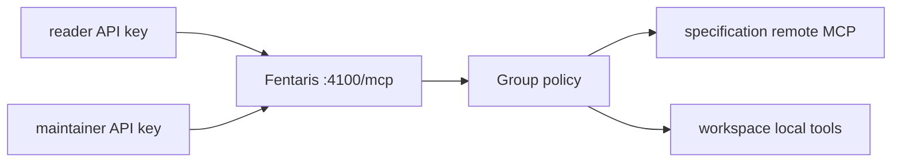

This example is a copyable, runnable project for a small team. It keeps the
endpoint on localhost, authenticates two users with Fentaris-managed API keys,
filters tools by group policy, connects a public remote MCP server, and exposes
app-owned tools through a local namespace.

The complete source lives in
[`examples/team-governed-proxy`](https://github.com/Fentaris/fentaris/tree/main/examples/team-governed-proxy).

## Architecture



| Subject | Policy-visible tools |
| --- | --- |
| `reader` / `readers` | `specification__*`, `workspace__status` |
| `maintainer` / `maintainers` | reader tools plus `workspace__release_notes` |

## Project files

### `src/index.ts`

```ts theme={null}
import {
  credentialJson,
  fentaris,
  group,
  jsonConsoleLogger,
  mcp,
  policy,
  streamableHttp,
  user,
} from "@fentaris/core";

const readerPolicy = policy("readers")
  .mcp("specification")
  .allow("*")
  .mcp("workspace")
  .allow("status");

const maintainerPolicy = policy("maintainers")
  .mcp("specification")
  .allow("*")
  .mcp("workspace")
  .allow("status")
  .mcp("workspace")
  .allow("release_notes");

const app = fentaris({
  logger: jsonConsoleLogger(),
  autoLog: true,
  groups: [
    group({
      id: "readers",
      users: [
        user("reader", {
          displayName: "Read-only teammate",
          apiKeys: [credentialJson("users.reader.apiKeys.0")],
        }),
      ],
      policy: readerPolicy,
    }),
    group({
      id: "maintainers",
      users: [
        user("maintainer", {
          displayName: "Maintainer",
          apiKeys: [credentialJson("users.maintainer.apiKeys.0")],
        }),
      ],
      policy: maintainerPolicy,
    }),
  ],
  servers: [
    mcp("specification", {
      displayName: "Public MCP Specification",
      transport: streamableHttp({
        url: "https://mcp.specification.website/mcp",
      }),
    }),
  ],
});

app.local("workspace")
  .tool("status", { inputSchema: { type: "object", additionalProperties: false } }, (ctx) => ({
    content: [{
      type: "text",
      text: JSON.stringify({
        status: "ready",
        subject: ctx.subject?.id ?? "anonymous",
        groups: ctx.subject?.groups.map((member) => member.id) ?? [],
      }),
    }],
  }))
  .tool("release_notes", { inputSchema: { type: "object", additionalProperties: false } }, () => ({
    content: [{
      type: "text",
      text: "Release notes are visible to maintainers only.",
    }],
  }));

app.use((ctx, next) => {
  ctx.log.setTag("subject", ctx.subject?.id ?? "anonymous");
  ctx.log.setTag("groups", ctx.subject?.groups.map((member) => member.id).join(",") ?? "");
  return next();
});

await app.start();
```

`app.mcp(...)` or constructor-time `mcp(...)` declares an upstream server.
`app.local(...)` declares app-owned MCP capabilities. Both use the same policy
namespace and client-visible `<namespace>__<tool>` naming.

### `fentaris.json`

```json theme={null}
{
  "name": "team-governed-proxy",
  "packageManager": "pnpm",
  "entrypoint": "src/index.ts",
  "port": 4100,
  "host": "127.0.0.1",
  "path": "/mcp",
  "authDir": ".fentaris"
}
```

### Package scripts

```json theme={null}
{
  "scripts": {
    "dev": "tsx src/index.ts",
    "build": "tsc -p tsconfig.json",
    "start": "node dist/index.js",
    "check": "fentaris check --offline --non-interactive",
    "doctor": "fentaris doctor --non-interactive"
  }
}
```

### Secrets manifest

The example has no upstream credential, so its committed manifest is empty:

```json theme={null}
{
  "version": 1,
  "references": []
}
```

API-key hashes are stored separately in the encrypted local auth store. Commit
the manifest; never commit `.fentaris/credentials.enc.json`.

## Install and validate

```bash theme={null}
cd examples/team-governed-proxy
pnpm install
pnpm build
pnpm check
pnpm doctor
```

Expected successful checks:

```txt
Project Check:
  ✓ All checks passed

Doctor:
  ✓ All checks passed
```

## Provision local API keys

Choose the encryption key outside the repository. Agents must leave the actual
value to the user or secret manager.

```bash theme={null}
export FENTARIS_AUTH_KEY="<local-encryption-key>"
pnpm exec fentaris auth api-key add reader --generate --non-interactive
pnpm exec fentaris auth api-key add maintainer --generate --non-interactive
```

Save each printed client key once. Fentaris stores only its hash, and clients
send the raw value in `x-fentaris-api-key`.

## Start and test

```bash theme={null}
pnpm dev
```

Expected startup:

```txt
Proxy ready
Listening on: http://127.0.0.1:4100/mcp
```

Run the authenticated curl sequence from the example
[README](https://github.com/Fentaris/fentaris/tree/main/examples/team-governed-proxy#test-an-authenticated-mcp-session),
or connect MCP Inspector and set the `x-fentaris-api-key` header.

Expected behavior:

- A reader sees and can call `workspace__status`.
- A reader does not see `workspace__release_notes`.
- A direct reader call to `workspace__release_notes` returns a policy denial.
- A maintainer sees and can call both local tools.
- `specification__*` tools are visible when the public upstream is reachable.

## Runtime validation

With the proxy running, export the same client API key used for the curl
tests so doctor can send `x-fentaris-api-key`:

```bash theme={null}
export FENTARIS_API_KEY="$READER_API_KEY"
pnpm exec fentaris doctor --runtime --non-interactive
```

Expected result:

```txt
Runtime
  ✓ MCP initialize
    Endpoint responded at http://127.0.0.1:4100/mcp
```

## Security boundaries

- The endpoint remains bound to `127.0.0.1`.
- Raw API keys and `FENTARIS_AUTH_KEY` never appear in source or logs.
- Policy filters both discovery and execution.
- JSON logging records subject and group tags, not credential values.
- Add explicit network and deployment controls before exposing the endpoint to
  other machines.
